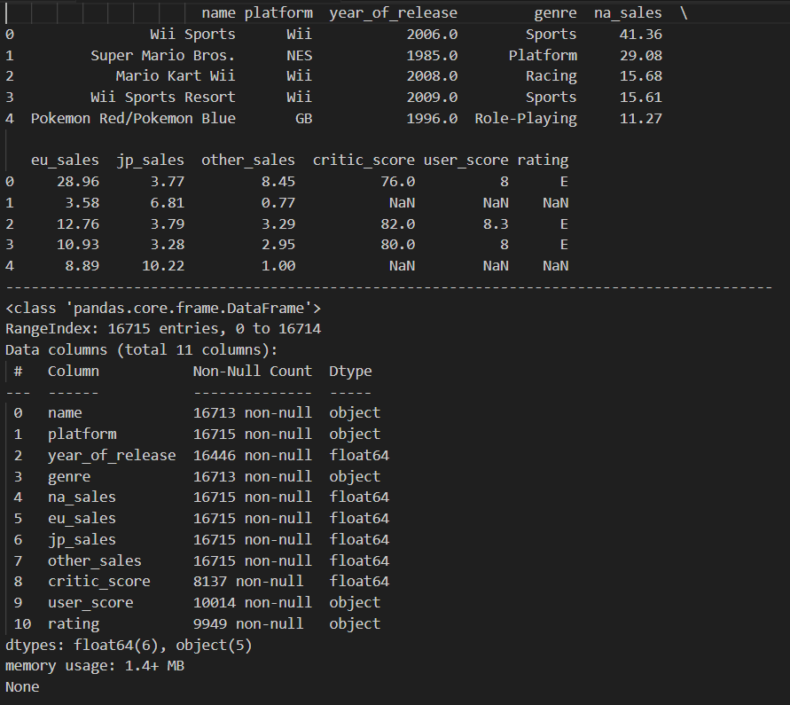
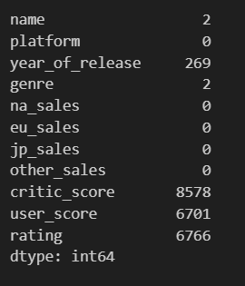
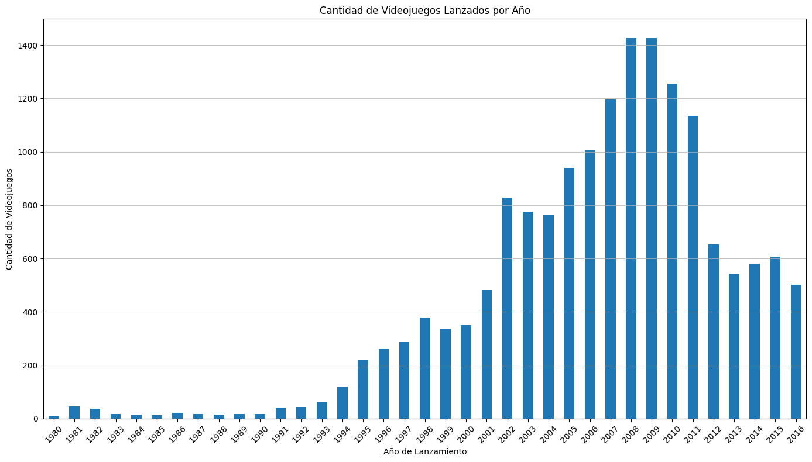
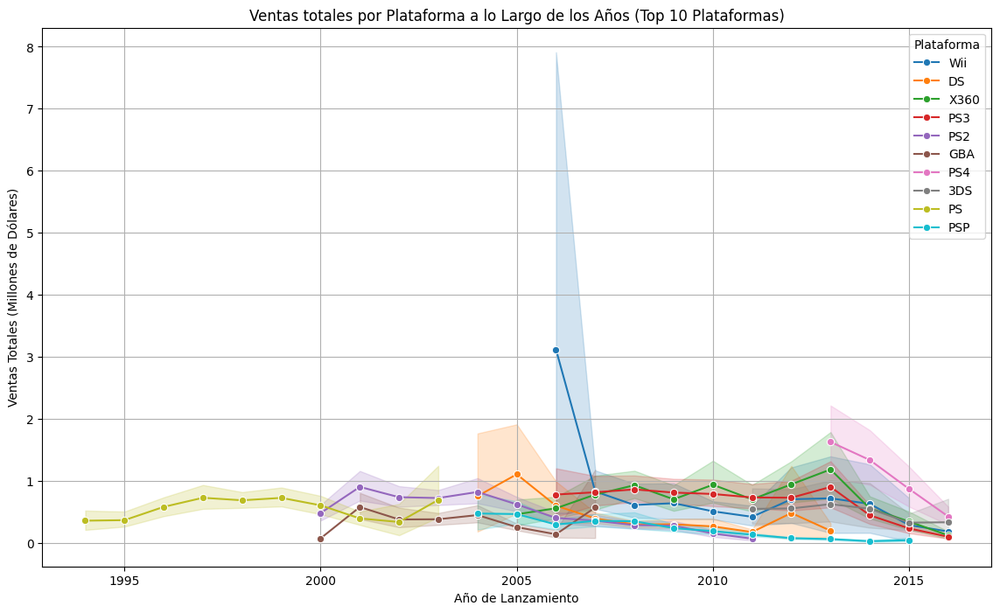
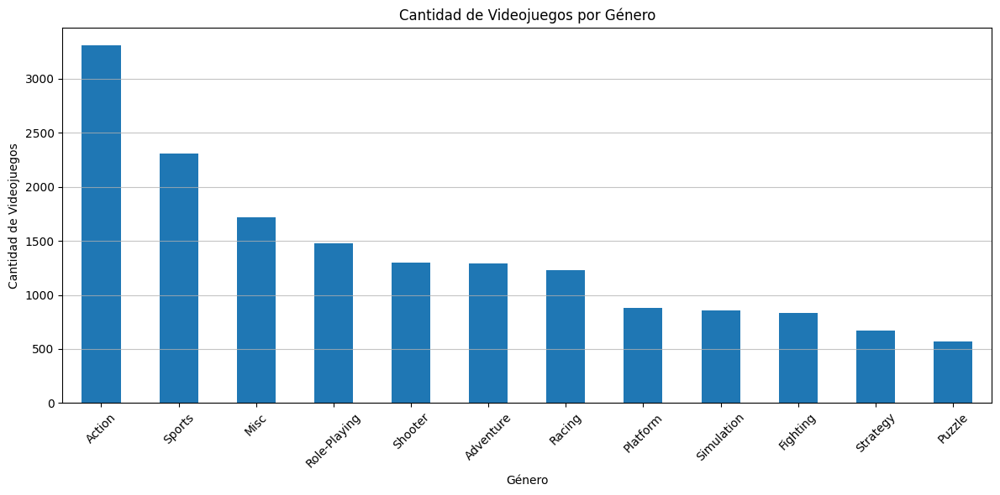
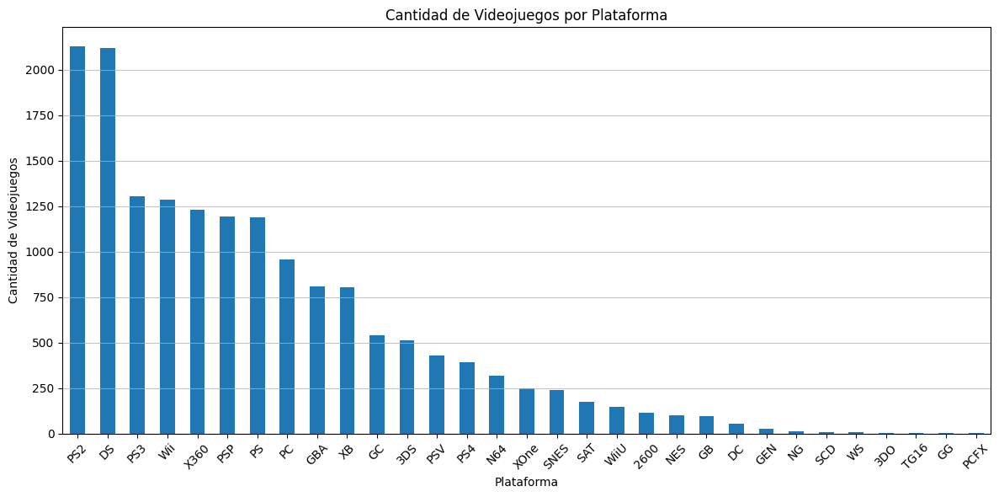
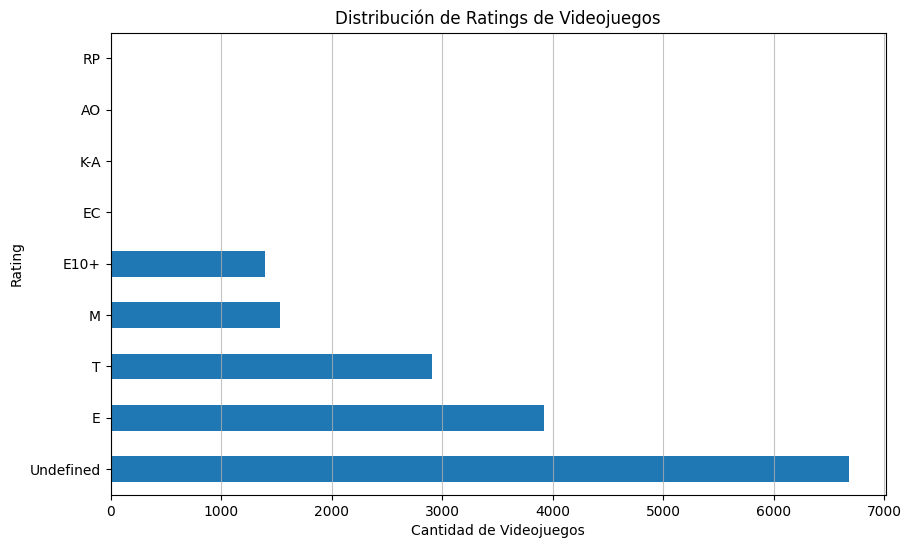
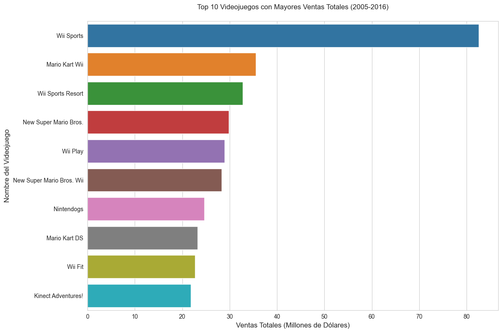
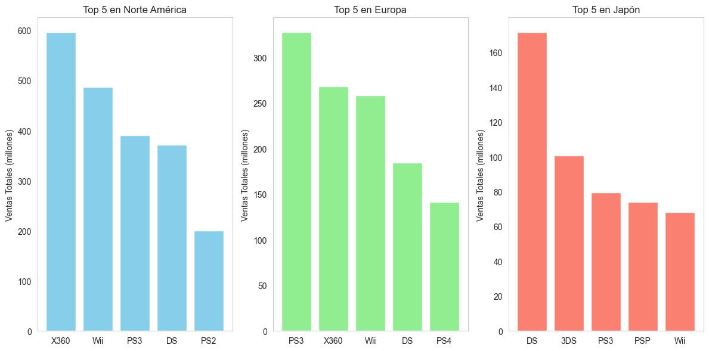
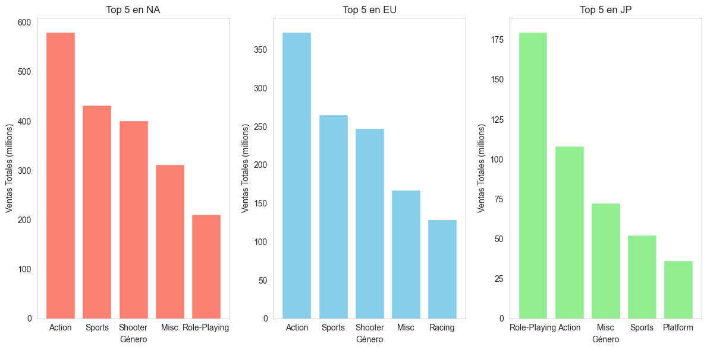

# Análisis de ventas de videojuegos: Insights del proyecto Ice Store

El **Proyecto Ice Store** es un análisis exhaustivo de las ventas de videojuegos desde 1980 hasta 2016. Este proyecto busca descubrir las tendencias y los factores que influyeron en el éxito de los videojuegos a lo largo de las décadas. Centrándose en las reseñas de usuarios y expertos, la popularidad de las plataformas y la distribución de géneros, el análisis sienta las bases para planificar una estrategia de marketing eficaz para 2017. Al comprender estas tendencias, podemos anticipar qué tipos de juegos y plataformas podrían tener más éxito el próximo año.

## 1. Limpieza: Tratamiento de nulos y duplicados
Para garantizar la calidad y la fiabilidad de nuestro análisis, comenzamos con una rigurosa preparación de datos. El conjunto de datos incluía información sobre nombres de juegos, plataformas, años de lanzamiento, géneros, ventas en diversas regiones y puntuaciones de usuarios y críticos.

Una de las observaciones iniciales fue la presencia de valores faltantes en las columnas críticas:

- La columna **"critic_score"** presentaba un 51 % de datos faltantes.
- La columna **"user_score"** presentaba un 40 % de valores faltantes.

Dada la considerable cantidad de datos faltantes, decidimos no imputar valores para evitar sesgos. En su lugar, preservamos la integridad de los datos dejando los valores *NaN* sin cambios, lo que permitió un análisis más transparente.

También realizamos los siguientes ajustes:

- Las entradas de **"user_score"** marcadas como *tbd* se reemplazaron por *NaN* y la columna se convirtió del tipo de *objeto* a *float64* para fines de cálculo.
- **Se eliminaron las filas** con valores nulos en columnas críticas como **nombre, género y año_de_lanzamiento**, ya que representaban solo el **1,63%** del total de registros.

Este enfoque mantuvo la autenticidad del conjunto de datos y facilitó un análisis más preciso.

## 2. EDA: Análisis exploratorio de tendencias anuales y por plataforma.
### Tendencias en los lanzamientos de videojuegos

Analizar el número de lanzamientos de videojuegos por año proporciona información valiosa sobre la evolución de la industria de los videojuegos. Los datos muestran tendencias distintivas a lo largo de diferentes décadas:

- **1980-1990:** Este período inicial marcó el inicio de la industria de los videojuegos, con un número relativamente bajo, pero constante, de lanzamientos de videojuegos. El aumento gradual refleja la adopción inicial de la tecnología de videojuegos.
- **Década de 1990-2000:** Se produjo un aumento significativo en el lanzamiento de videojuegos, en consonancia con la expansión de consolas avanzadas como PlayStation y Nintendo 64.
- **2001-2010:** Esta década experimentó un auge sustancial, especialmente alrededor de 2008 y 2009, impulsado por plataformas como PlayStation 2, Xbox 360 y Nintendo Wii. Este pico destaca un período de rápido crecimiento en la industria de los videojuegos.
- **2011-2016:** Se observó un ligero descenso en el lanzamiento de videojuegos, probablemente debido a la saturación del mercado y a una transición hacia los juegos móviles y la distribución digital.

Estas tendencias resaltan cómo los avances tecnológicos y la dinámica del mercado han moldeado la producción de videojuegos a lo largo de los años.

### Plataformas principales y vida útil
El análisis también examinó las plataformas más populares y la duración de sus ciclos de vida. Los datos clave incluyen:

- **PS2 y Xbox 360** se destacaron como las plataformas con la vida útil más larga, manteniendo su popularidad durante aproximadamente 11 años cada una.
- **Wii y PS3** mantuvieron una vida útil significativa de aproximadamente 10 años.
- Plataformas como **PS4**, introducidas posteriormente en el conjunto de datos, mostraron una duración observada más corta, principalmente debido al corte de datos en 2016.

Comprender estas tendencias del ciclo de vida es esencial para identificar qué plataformas pueden ofrecer oportunidades de venta sostenidas para futuros lanzamientos de juegos.

### Géneros de juegos principales
El conjunto de datos reveló la distribución de los géneros de juegos, donde los juegos de **Acción** dominan el panorama, representando el 20,11% de todos los lanzamientos. Les siguen los juegos de **Deportes**, con el 14,02%. Otros géneros destacados incluyen **Juegos de Rol y Disparos**

Curiosamente, géneros de nicho como los juegos de **Estrategia y Rompecabezas** mostraron una popularidad significativa en regiones como Japón, lo que refleja las preferencias del mercado local.

### Principales Plataformas y Lanzamientos de Juegos

Un análisis más detallado de los lanzamientos de juegos por plataforma revela tendencias significativas en la industria de los videojuegos:

- **PlayStation 2 (PS2) y Nintendo DS (DS)** lideran el grupo, con más de 2000 juegos cada una. Esto destaca su larga popularidad y sus extensas bibliotecas de juegos, dirigidas a un público amplio.
- Plataformas como **PS3, Wii y Xbox 360** también presentaron una cantidad considerable de lanzamientos, lo que subraya su relevancia durante sus años de auge.
- El menor número de lanzamientos para plataformas como **Sega Dreamcast (DC) y PC-FX** refleja su menor vida útil o su atractivo para nichos de mercado.

Comprender la distribución de las clasificaciones de juegos es esencial para adaptar el desarrollo y las estrategias de marketing a públicos específicos. El gráfico que detalla el número de juegos por clasificación revela lo siguiente:

- Una parte significativa de los juegos tenía una clasificación **"Indefinida"**, lo que indica la ausencia de una clasificación formal o limitaciones en el conjunto de datos.
- La categoría de clasificación **"E" (Para todos)** fue la más común entre las clasificaciones definidas, lo que sugiere que los juegos aptos para familias y de acceso universal dominan el mercado.
- Las clasificaciones **"T" (Adolescentes) y "M" (Maduro)** también representaron una parte sustancial del conjunto de datos, lo que refleja un mercado diverso que atiende a públicos de mayor edad.
- Las clasificaciones de nicho como **"AO" (Solo adultos) y "KA" (Niños a adultos)** tuvieron una representación mínima, en consonancia con las prácticas de la industria que favorecen los juegos para un público más amplio para maximizar el alcance del mercado.

Estos hallazgos sugieren que centrarse en juegos con clasificación **"E" y "T"** podría ser estratégicamente beneficioso para llegar a una amplia base de consumidores, a la vez que se integran géneros atractivos para el público adulto en campañas más específicas.

### Información de ventas y juegos más vendidos
Una parte esencial del Proyecto Ice Store consistió en analizar los datos de ventas para identificar el rendimiento regional y los videojuegos más vendidos del conjunto de datos. Este análisis proporciona información valiosa sobre las tendencias del mercado y las preferencias de los consumidores en las diferentes regiones.

### Rendimiento regional de ventas
El análisis de ventas por región reveló que:

- **Norteamérica** lideró las ventas totales, representando la mayor parte de los ingresos globales. Este dominio destaca el importante potencial de mercado en la región para desarrolladores y editores de juegos.
- **Europa** le siguió de cerca, con cifras de ventas sustanciales, lo que indica su importancia como mercado secundario clave.
- **Japón**, aunque con menores ventas totales, mostró preferencias de juego únicas, a menudo favoreciendo géneros y juegos que se adaptan específicamente a los gustos locales.
- **Otras regiones** (agrupadas como "Otros") representaron una porción menor pero significativa de las ventas globales, lo que refleja el crecimiento potencial en los mercados emergentes.

Estos datos son esenciales para los equipos de marketing que buscan priorizar las regiones según su contribución a las ventas globales.

### Los 10 videojuegos más vendidos
Los 10 videojuegos más vendidos del conjunto de datos destacaron a los claros ganadores que impulsaron las ventas en todas las regiones:

- **"Wii Sports"** se alzó como el juego más vendido, impulsado por su paquete con la consola Nintendo Wii y su atractivo para toda la familia.
- **"Grand Theft Auto V"**, conocido por su amplia jugabilidad y su amplio alcance, demostró cómo los juegos para adultos pueden alcanzar grandes ventas.
- **"Mario Kart Wii"** y otros títulos de la franquicia Mario subrayaron la perdurable popularidad de los juegos familiares de Nintendo.

Estos juegos estrella compartían características comunes: un fuerte reconocimiento de marca, disponibilidad multiplataforma o una jugabilidad innovadora que atraía a un público amplio. Para los actores de la industria de los videojuegos, centrarse en títulos que puedan emular estas exitosas características podría generar ganancias lucrativas.

### Información de ventas mejorada y juegos más vendidos
El desglose regional de las ventas por plataforma ofrece una visión matizada de las preferencias de los consumidores en los principales mercados de videojuegos:

## 3. Profiling: Creación de perfiles de usuario por región.
### Ventas por plataforma regional
- **Norteamérica:** La **Xbox 360** se convirtió en líder, seguida de cerca por la **Wii y PS3**, lo que ilustra una fuerte preferencia por plataformas que ofrecían catálogos de juegos versátiles y una jugabilidad innovadora.
- **Europa: La PS3** lideró las ventas, seguida de la **Xbox 360 y la Wii**, lo que refleja una competencia equilibrada entre estas plataformas. La presencia de la **Wii** en el top 5 refuerza el atractivo de los juegos interactivos y para toda la familia en la región.
- **Japón:** **Nintendo** dominó el mercado con las **DS y 3DS**, lo que pone de relieve la gran popularidad de los juegos portátiles. Las plataformas **PlayStation (PSP, PS3)** también tuvieron un buen rendimiento, lo que subraya la importante presencia de Sony en el mercado japonés.

Estos gráficos ofrecen información clave para definir estrategias de marketing específicas para cada plataforma, considerando las preferencias regionales que históricamente han determinado el rendimiento de las ventas. Comprender estas tendencias ayuda a identificar en qué plataformas centrarse para las campañas regionales, maximizando así el impacto en Norteamérica, Europa y Japón.

Incorporaré en el artículo estas visualizaciones de los géneros principales por ventas en diferentes regiones. Así es como las añadiré a la sección de Información de Ventas y Juegos Más Vendidos:

### Géneros Principales por Ventas Regionales
Comprender los géneros de juegos más populares en diferentes regiones proporciona información valiosa para dirigir el contenido a audiencias específicas:

- **Norteamérica:** El género de **Acción** lideró las ventas, seguido de los juegos de **Deportes y Disparos**. Esto indica una preferencia por una jugabilidad atractiva y dinámica. La presencia de juegos **Miscellaneous (Varios)** también refleja un interés diverso en diversos tipos de juegos.
- **Europa:** Al igual que en Norteamérica, los juegos de **Acción** dominaron las ventas, seguidos de cerca por los de **Deportes y Disparos**. Esto sugiere que los mercados europeo y norteamericano comparten gustos similares en cuanto a juegos, lo que facilita la planificación de estrategias de marketing interregionales. 
- **Japón:** El género de **rol (RPG)** lideró las ventas con un margen significativo, mostrando una clara preferencia regional por los juegos con una historia centrada en los personajes. Los juegos de **Acción y Varios** también tuvieron un buen desempeño, mientras que los juegos de **Deportes y Plataformas** contribuyeron con una participación menor, pero notable.

Estos hallazgos resaltan la importancia de las estrategias específicas para cada región al planificar lanzamientos de juegos y campañas de marketing. Por ejemplo, centrarse en los juegos **RPG**** en Japón y promocionar juegos de **Acción y Deportes** en los mercados occidentales podría maximizar el potencial de ventas.

## Recomendaciones para la Estrategia Futura
Con base en el análisis de las tendencias históricas, la popularidad de las plataformas, la distribución de géneros y el rendimiento de las ventas, se pueden hacer varias recomendaciones estratégicas para los equipos de marketing y desarrollo de producto que buscan maximizar el éxito en 2017:

1. **Apuntar a las plataformas populares**
2. **Centrarse en los géneros más populares**
3. **Aprovechar los juegos familiares y con clasificación universal**
4. **Capitalizar las preferencias regionales**
5. **Promocionar franquicias consolidadas**

Estas recomendaciones buscan alinear las nuevas estrategias de desarrollo y marketing de juegos con la información basada en datos de éxitos pasados ​​y el comportamiento del mercado.

# Conclusión
El análisis del Proyecto Ice Store sobre las ventas de videojuegos de 1980 a 2016 proporciona una base sólida para comprender la dinámica de la industria del videojuego. Al centrarse en plataformas populares, aprovechar los géneros más populares y adaptar las estrategias a las preferencias regionales, las partes interesadas pueden optimizar su estrategia de lanzamiento y marketing de juegos. Esta estrategia basada en datos allana el camino para un posicionamiento más sólido en un mercado competitivo, impulsando el crecimiento sostenido y la participación de los jugadores.

Haga clic aquí para explorar el análisis completo y los detalles técnicos del Proyecto Ice Store. Aquí encontrará el Jupyter Notebook completo con código, visualizaciones y explicaciones detalladas de las metodologías y los conocimientos adquiridos a lo largo del proyecto.

